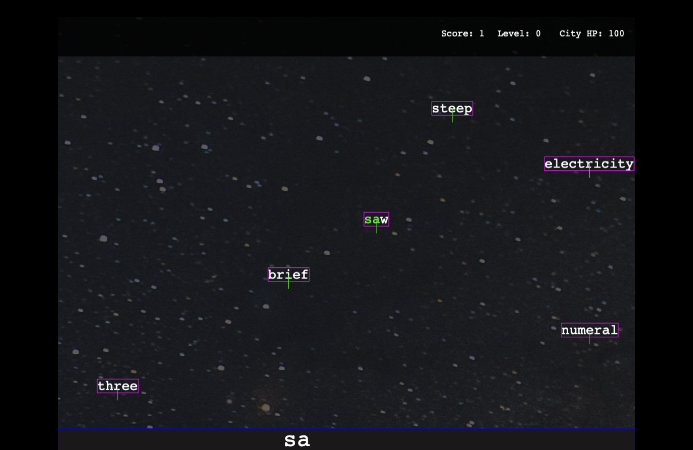

# TypeShooter

TypeShooter is an action-packed typing game where you defend your city by typing words that fall from the sky. Test your typing speed and accuracy as you race against time to protect your city from falling words.



## 🎮 Game Overview

In TypeShooter, words randomly fall from the top of the screen. Players must type these words correctly before they reach the bottom of the screen. Each word that hits the ground reduces the city's health. The game progressively gets more challenging as levels increase, with words falling at faster speeds.

## 📋 Features

- **Progressive Difficulty**: The game increases in difficulty over time as you level up
- **Real-time Feedback**: Words change color as you type, showing your progress
- **Score Tracking**: Keep track of your score and level
- **City Health System**: Protect your city by preventing words from hitting the ground
- **Responsive Design**: Automatically adjusts to fit different screen sizes

## 🕹️ How to Play

1. Words will fall from the top of the screen
2. Type the falling words exactly as they appear
3. Press Enter or complete the word to destroy it
4. Prevent words from hitting the ground to protect your city's health
5. The game gets faster with each level
6. Game ends when your city's health reaches zero

### Controls
- **Type** the letters shown on screen
- **Backspace** to delete the last character
- **Ctrl+Backspace** (or Cmd+Backspace) to clear your input
- **Enter** to reset your input

## 🚀 Getting Started

### Prerequisites

- Node.js (v14 or newer)
- npm or yarn

### Installation

1. Clone the repository:
   ```
   git clone https://github.com/Qayyax/TypeShooter.git
   cd TypeShooter
   ```

2. Install dependencies:
   ```
   npm install
   ```

3. Start the development server:
   ```
   npm run dev
   ```

4. Open your browser and navigate to `http://localhost:8080` (or the port shown in your terminal)

## 🛠️ Built With

- [Phaser 3](https://phaser.io/phaser3) - HTML5 Game Framework
- [TypeScript](https://www.typescriptlang.org/) - Typed JavaScript
- [Vite](https://vitejs.dev/) - Next Generation Frontend Tooling
- [random-words](https://www.npmjs.com/package/random-words) - Random word generator

## 🧠 Game Mechanics

- Words are randomly generated using the `random-words` library
- Word falling speed increases with each level
- Each word that hits the ground reduces city health by 5 points
- Game ends when city health reaches 0
- Level increases every 30 seconds
- The game keeps track of your score (number of words successfully typed)

## 📝 Future Enhancements

- Different word types (uppercase, title case, with numbers)
- Power-ups and special abilities
- Multiple difficulty levels
- Online leaderboards
- Sound effects and background music
- Visual effects for destroyed words

## 📄 License

This project is licensed under the MIT License - see the LICENSE file for details.
